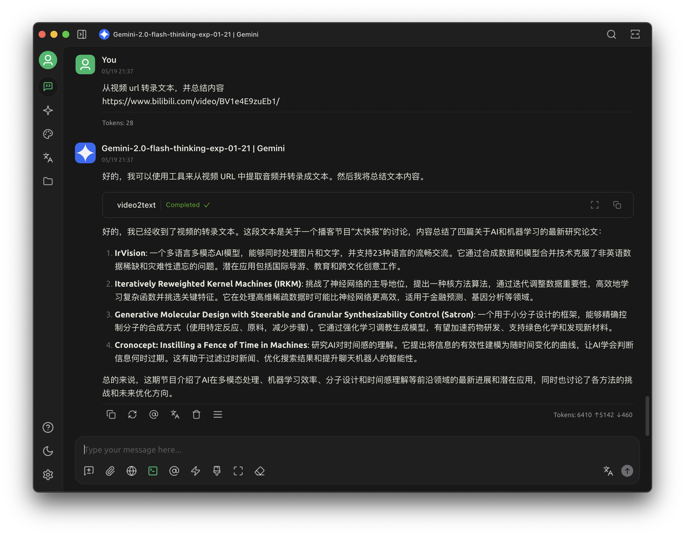

# mcp-video2text

Convert online video to text, read it quickly



## Usage
```bash
$ uv pip install git+https://github.com/yanyaoer/mcp-video2text.git@main[mlx]
$ uv pip install git+https://github.com/yanyaoer/mcp-video2text.git@main[cpp]
```
for mcp client, pass `uv run mpc-video2text` to `command` field

first run will download whisper model, should spend a few minutes,
recommend update the timeout settings by your client.

or your can custom your own client, view example `test_mcp_client.py`

```python
import asyncio
import os

from mcp import ClientSession, StdioServerParameters
from mcp.client.stdio import stdio_client


async def client():
  server_params = StdioServerParameters(
    command="uv", args=["run", "video2text.py"], env=os.environ
  )
  async with stdio_client(server_params) as (read, write):
    async with ClientSession(read, write) as session:
      await session.initialize()
      print(await session.list_tools())
      result = await session.call_tool(
        "video2text", {"url": "https://www.bilibili.com/video/BV1gdERzuEYB/"}
      )
      print(result.content[0].text)


if __name__ == "__main__":
  asyncio.run(client())
```

## Thanks
- https://github.com/yt-dlp/yt-dlp
- https://github.com/k2-fsa/sherpa-onnx
- https://github.com/ggerganov/whisper.cpp
- https://github.com/absadiki/pywhispercpp
- https://github.com/pydantic/pydantic-ai
- https://github.com/yetone/avante.nvim
